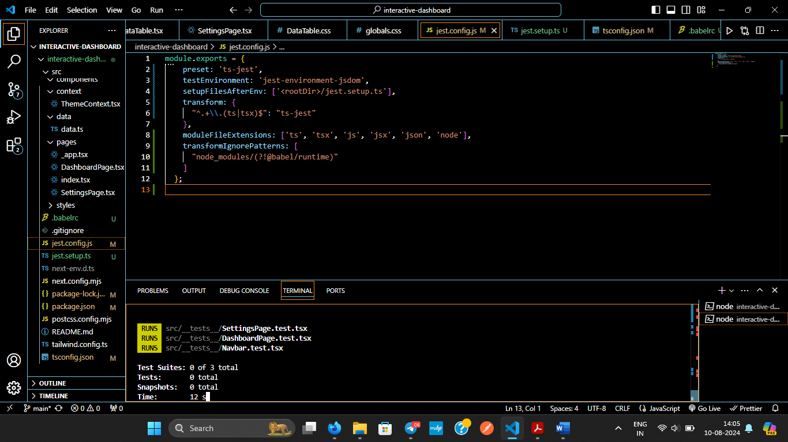

# Interactive Dashboard

## Overview

This project is an interactive dashboard application where you can customize the chart types and themes. It includes:

- **3 types of charts**: Line Chart, Bar Chart, and Data Table.
- **3 themes**: Light Mode, Dark Mode, and Custom Theme.
- **Responsive Design**: The dashboard is designed to be responsive and look great on all devices.

## Features

- **Chart Types**: Choose between Line Chart, Bar Chart, or Data Table in the settings.
- **Themes**: Switch between Light Mode, Dark Mode, or a Custom Theme.
- **Responsive Layout**: Optimized for various screen sizes and devices.

## Getting Started

1. **Clone the Repository**

   Clone the repository to your local machine:

   ```bash
   git clone https://github.com/ankit-Tiwari2003/interactive-dashboard.git

-**in Terminal**
cd interactive-dashboard

npm i

npm run dev

-**to run tests**

npm test



-**Deployment**

 `#`

